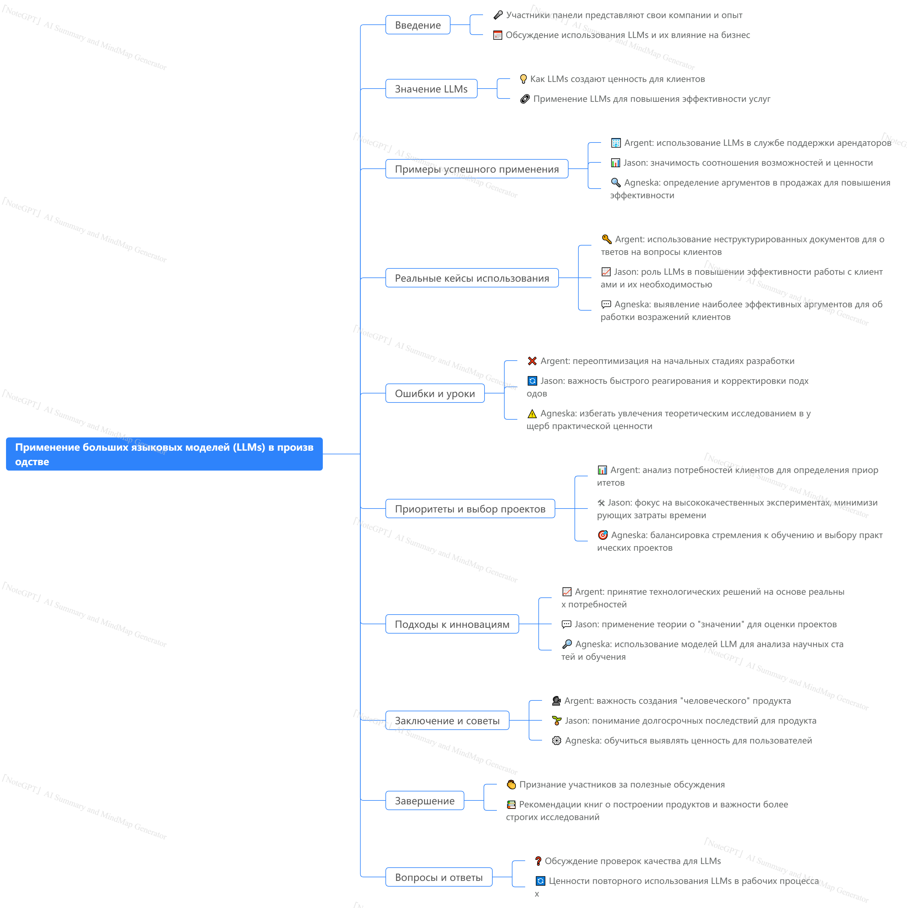

# Применимости LLM

Посмотрим, для каких еще задач можно применять LLM в one-shot режиме.

## Questions

- Что такое NER - Named Entity Recognition?
- Что еще кроме присловутых *суммаризаций, переводов, генерации кода* мо можем попросить у LLM?
- Может ли LLM выполнять роли управляющего - писать промпты, запросы в гугл, писать ТЗ для разработчиков?

## Steps

### 1. Изучаем промпты (по-другому быстро не научиться)

Посетите оба сайта:

1. https://www.promptingguide.ai/prompts

2. https://www.ai-cookbook.ru/docs/prompts/

Те кейсы, которые вам из названия на **1000%** понятны, пропускайте. Всё остальное желательно прочитать, чтобы прокачать насмотренность и промпт-*интуицию*.

### E1. bonus

Не очень информативное видео но лучшее что есть на YT.

<iframe width="560" height="315" src="https://www.youtube.com/embed/w3Ew2tTDGwo?si=oAX4yHowZE0vHGtW" title="YouTube video player" frameborder="0" allow="accelerometer; autoplay; clipboard-write; encrypted-media; gyroscope; picture-in-picture; web-share" referrerpolicy="strict-origin-when-cross-origin" allowfullscreen></iframe>

## Exercises

- Подумайте, каким инструкциям LLM не умеет следовать сейчас или следует крайне плохо?
- Как вы думаете, какие инструкции LLM будет плохо выполнять в 2030 году? В 2040?

