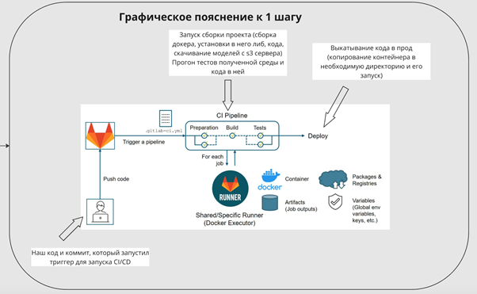
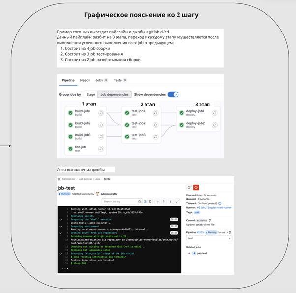

# Облака и Virtual Private Server

Представьте, что вы строите небоскрёб AI Агентов - без прочного фундамента облачной инфраструктуры ваше сооружение рухнет при первом же потоке реальных пользователей. Здесь мы освоим Docker-контейнеры как универсальные "грузовики" для доставки моделей, оркестрацию Kubernetes как систему "светофоров" для трафика запросов, и научимся разворачивать сервисы в AWS/GCP-облаках как космические станции для ваших AI Агентов. Эти навыки - кислородная маска для любого продакшн-проекта: без них ваши гениальные модели так и останутся локальными скриптами на ноутбуке.

<details>
<summary>Инструкция к Ask AI</summary>

:::tip инструкция
Так как данные темы не меняются со временем, лучше всего вам изучать их с персональным преподавателем - ChatGPT.

Процесс изучения должен быть следующим:
- вы составляете системный промпт для ChatGPT ([шаблоны](../metalearning#chatgpt-prompts)), где описываете свой бэкграунд, предпочтения, уровень подробности объяснений и т.д.
- копируете тему из списка (тройной клик), и просите ChatGPT объяснить вам эту тему
- при желании углубиться, задаете уточняющие вопросы 

На данный момент это самый удобный способ изучения основ. **Кроме концептов, вы можете изучать дополнительные материалы в секциях Gold, Silver, Extra.** 
1. Gold - стоит обязательно изучить до общения с ChatGPT
2. Ask AI - задавайте вопросы по каждой малознакомой теме
3. Silver - второстепенные материалы
4. Extra - углубленные темы
:::

</details>

## Golden

<details>
<summary>Docker</summary>

<iframe width="560" height="315" src="https://www.youtube.com/embed/Gjnup-PuquQ?si=UfwaYs0OB-GZMncF" title="YouTube video player" frameborder="0" allow="accelerometer; autoplay; clipboard-write; encrypted-media; gyroscope; picture-in-picture; web-share" referrerpolicy="strict-origin-when-cross-origin" allowfullscreen></iframe>
<iframe width="560" height="315" src="https://www.youtube.com/embed/aZTL2zRmOnA?si=ExyRssNH0tSo0Otz" title="YouTube video player" frameborder="0" allow="accelerometer; autoplay; clipboard-write; encrypted-media; gyroscope; picture-in-picture; web-share" referrerpolicy="strict-origin-when-cross-origin" allowfullscreen></iframe>
<iframe width="560" height="315" src="https://www.youtube.com/embed/rIrNIzy6U_g?si=gHZNVM3JPGuhQA8h" title="YouTube video player" frameborder="0" allow="accelerometer; autoplay; clipboard-write; encrypted-media; gyroscope; picture-in-picture; web-share" referrerpolicy="strict-origin-when-cross-origin" allowfullscreen></iframe>
<iframe width="560" height="315" src="https://www.youtube.com/embed/eGz9DS-aIeY?si=6qbM1MIwE52J97lJ" title="YouTube video player" frameborder="0" allow="accelerometer; autoplay; clipboard-write; encrypted-media; gyroscope; picture-in-picture; web-share" referrerpolicy="strict-origin-when-cross-origin" allowfullscreen></iframe>

</details>


## Ask AI


### Docker: 20 must-know тем для GenAI инженера

1. **Архитектура контейнеризации: сравнение виртуальных машин и Docker**  
2. **Docker vs Conda/venv: ключевые отличия и сценарии применения**  
3. **Пошаговая установка Docker на разных операционных системах**  
4. **Основные команды Docker CLI: управление контейнерами и образами**  
5. **Создание Dockerfile: синтаксис и практические шаблоны**  
6. **Работа с Docker-образами: сборка, тегирование и публикация**  
7. Docker Hub: базовые операции (Обзорно)  
8. **Работа с томами: практическое использование volumes и bind mounts**  
9. Сетевые модели в Docker: основные типы подключений (Кратко)  
10. Микросервисная архитектура: базовые принципы (Кратко)  
11. **Настройка окружений с Docker Compose: создание и отладка конфигов**  
12. **Оптимизация Docker-образов: уменьшение размера и ускорение сборки**  
13. Слои образов: механизм кэширования и зависимостей (Обзорно)  
14. **Упаковка Python-приложений: зависимости и окружение в контейнере**  
15. **Настройка GPU в Docker для машинного обучения: полный гайд**  
16. Хранилища данных: локальные и облачные решения (Краткий обзор)  
17. **Работа с облачными registry: практические примеры ECR/Artifact Registry**  
18. Выбор базового образа: Alpine vs Ubuntu (Сравнение и рекомендации)  
19. **Настройка автозапуска контейнеров через systemd (Практикум)**  
20. **Оптимизация производительности: cold vs hot start в продакшн-средах**

## Silver

*Про деплой by Дмитрий Савелко*

### Разница между docker, conda, env
Очень часто люди путаются между docker, conda, env. Поэтому написал небольшое пояснение, что представляет каждый из них:

**env (environment)** - это виртуальное пространство, в которое можно устанавливать python либы. По умолчанию использую pip install мы просто инсталим библиотеки в директорию по умолчанию. Это не лучший путь, особенно, если у нас несколько проектов (ещё хуже, если проект большой, а работает на общем сервере, где один python на всех). Одним из решений является env, который позволяет нам создать выделенную среду, куда мы будем устанавливать необходимые нам библиотеки. Таким образом, мы можем создавать несколько сред с разными наборами библиотек под разные проекты/задачи

**conda** - она схожа с env, но обладает повышенной функциональность. В целом я бы сказал, что это что-то среднее между докером и env. Conda - это пакетный менеджер виртуальная среда одновременно, которая помимо установки библиотек также даёт возможность:
    1.	Устанавливать python любой нужной версии
    2.	Частично устанавливать библиотеки nvidia (например, какой-нибудь cublas или cudnn, которые по умолчанию могут быть не установлены на сервере, или по классике быть не той версии).

**Docker** - это инструмент и платформа для создания, развертывания и управления контейнерами. Контейнеры представляют собой легковесные и изолированные среды выполнения, которые включают всё необходимое для работы приложения: код, библиотеки, зависимости, конфигурации и операционную систему. Контейнер буквально имеет свою операционную систему и среду, которая может отличаться от той, что по умолчанию установлена на сервере.

Таким образом с помощью докер контейнера мы можем собрать полноценное окружение для нашего проекта, которое чаще всего содержит:
    1.	Набор библиотек и пакетов операционной системы (всё, что ставится через apt и либы nvidia)
    2.	python нужной нам версии
    3.	либы для python
    4.	код программы
    5.	настройки окружения (например, конфигурации proxy)

Docker тяжёлое решение по сравнению с env и conda, но при этом самое гибкое и настраиваемое. Сам контейнер обычно собирается с помощью Dockerfile, после чего к нему можно подключиться и работать в своей изолированной операционной системе, не боясь что-то поломать на общем сервере.

### Пример процесса деплоя
[Хорошая статья на хабре про деплой на 10 минут](https://habr.com/ru/companies/softmart/articles/310502/)

В данном гайде будет описан пример деплоя с помощью GitLab CI/CD и s3 сервера (всё, что нужно про него знать, это то что, он используется для хранения файлов, а файлы с него стаскиваются с помощью python скриптов) как один из самых распространённых. В каких-то деталях процесс может отличаться, но общая логика везде одинаковая. Сам деплой обычно настраивают DevOps/MLOps, от DataScientist чаще всего требуется просто прожимать кнопки в GitLab (если он настроен нормально). Также, для деплоя могут быть использованы GitHub Actions, Jenkins, там процесс выглядит примерно также.

Начнём с того, что вообще такое Deploy (развертывание) — это процесс переноса приложения или программного кода с этапа разработки на сервер производственной среды (продакшн), тестовый сервер или другое целевое окружение, где оно будет запущено и доступно для использования.

CI/CD - если по простому, то это набор скриптов, которые определяют как и в каком порядке у нам будет проводиться деплой

Деплой происходит чаще всего в 2 случаях:
1.	Отладка готовой модели на dev/test сервере
2.	Выкатка модели в прод, после отладки

Будем считать, что у нас уже есть обученная модель, которая хранится в какой-то директории на s3, а также мы имеем какое-то приложение/код, которое крутится на dev/prod серверах, для простоты, это будет просто приложение на fast api, которое просто ждёт запрос по конкретной ссылки (ручке) и по другой возвращает ответ (например, ждёт на вход какой-то набор текста, а возвращает ответ модели полученный после его прогона).

#### Процесс деплоя:

**1 шаг.** Мы добавили какое-то обновление в код и хотим его задеплоить в dev. CI/CD в гитлаб устроен так, что просто ждёт новый коммит (триггер активации) в код, после чего запускает процесс деплоя. Для удобства CI/CD настраивают так, чтобы он запускался только при пуше в какую-то ветку, например: release, develop, test. Репозиторий с кодом приложения чаще всего содержит внутри себя:
    1.	Dockerfile, для сборки контейнера
    2.	requirements.txt для установки либ питона
    3.	Набор ключей (кред) для доступа к файлам внутри организации
    4.	Сам код приложения


 
**2 шаг.** После того, как мы отправили коммит в dev ветку запускается деплой, а конкретно deploy pipeline. Pipeline определяет в каком порядке он будет происходить. pipeline состоит из job. Каждая job'а отвечает за один конкретный этап в деплое, например: сборка докера, тесты сборки, раскатка в прод. Предположим, что наш пайлайн состоит из следующих job:
     1.Проверка наличия всех необходимых файлов для сборки образа
     2.Сборка докер контейнера, которая включается в себя:
        1.	сборку контейнера;
        2.	установку в него всех необходимых нам для работы либ;
        3.	стягивание модели с s3 сервера; копирование кода сервиса;
        4.	запуск сервиса с помощью .sh скрипта.
    Таким образом мы получаем полностью собранный и готовый к работе docker     контейнер с запущенным в нём сервисом/приложением
         3.Тестирование полученного контейнера
         4.Раскатка на dev сервере
         5.Удаление лишних файлов сборки/кред

Отслеживать выполнения каждой джобы можно в пайплане, либо кликнуть на неё и увидеть консоль с логами её выполнения



После запуска пайплайна он начёт поэтапно запускать все job'ы в себе, до тех пор, пока не дойдёт до шага с раскаткой на сервере

 

**3 шаг.** Чаще всего (при нормальной настройке CI/CD) шаг с раскаткой на сервере требует подтверждения от пользователя. Подтверждение осуществляется кликом по кнопке в джобе. Раскатка на сервер может быть осуществлена разными вариантами, но чаще всего собранный нами контейнер копируется на целевое железо, где заново запускается и начинает полноценную работу

### Практические примеры

#### Многостадийная сборка образа
```dockerfile
# Билд-стадия: устанавливаем зависимости в временный образ
FROM python:3.9-slim as builder
COPY requirements.txt .
RUN pip install --user -r requirements.txt  # --user для изоляции в .local

# Финальный образ: копируем только необходимое из builder
FROM python:3.9-alpine  # Alpine Linux - минималистичный образ
COPY --from=builder /root/.local /root/.local  # Копируем установленные пакеты
COPY . /app  # Добавляем исходный код приложения
ENV PATH=/root/.local/bin:$PATH  # Добавляем путь к установленным пакетам
CMD ["python", "/app/main.py"]  # Точка входа приложения
```

#### Systemd сервис для автозапуска
```bash
# /etc/systemd/system/ml-service.service
[Unit]
Description=ML Service  # Имя сервиса
After=network.target    # Запускать после инициализации сети

[Service]
Type=simple
WorkingDirectory=/opt/ml  # Рабочая директория с docker-compose.yml
ExecStart=/usr/bin/docker-compose up  # Основная команда запуска
Restart=always  # Автоматический рестарт при падении

[Install]
WantedBy=multi-user.target  # Запуск при старте системы

# Активация сервиса:
# sudo systemctl daemon-reload
# sudo systemctl enable ml-service
# sudo systemctl start ml-service
```

#### Время старта разных образов (холодный старт)
| Образ         | Размер  | Время старта | Использование         |
|---------------|---------|--------------|-----------------------|
| python:alpine | 58MB    | 1.2s         | Продакшен API         | # Минимальный образ для микросервисов
| ubuntu:latest | 77MB    | 2.1s         | Разработка/тестирование | # Полноценная ОС для отладки
| nvidia/cuda   | 4.7GB   | 8.5s         | ML-тренировки         | # Тяжелый образ с GPU-драйверами


- *Холодный старт - время от docker run до готовности приложения*
- *Горячий старт (после остановки/перезапуска) обычно на 30-40% быстрее*


## Extra


