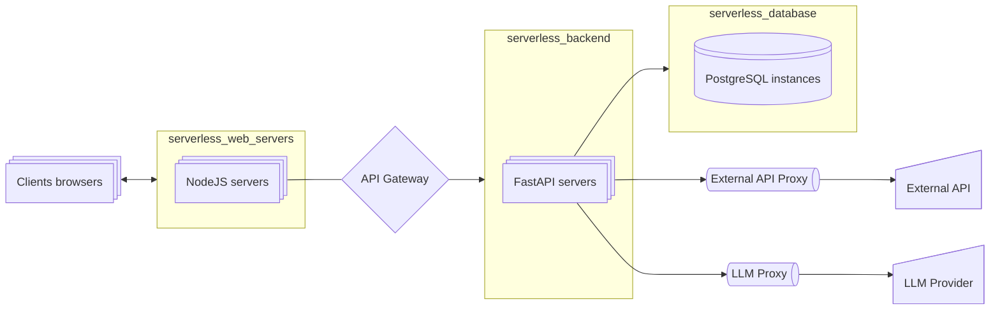

# Микросервисы и системная архитектура для Applied AI

Представьте, что микросервисы - это модульные космические корабли, а Docker - ваш личный космодром для их сборки. Здесь вы научитесь проектировать "орбитальные станции" для AI Агентов: разбивать монолитные системы на автономные сервисы-спутники, настраивать их взаимодействие через межзвёздные протоколы (REST/gRPC) и автоматизировать развёртывание с помощью CI/CD-ракетоносителей. Эти навыки позволят вашим нейросетям масштабироваться как галактическая империя, обновляться без простоев и переживать сбои отдельных компонентов без коллапса всей системы.

Инструкция к Ask AI

:::tip инструкция
Так как данные темы не меняются со временем, лучше всего вам изучать их с персональным преподавателем - ChatGPT.

Процесс изучения должен быть следующим:
- вы составляете системный промпт для ChatGPT ([шаблоны](../metalearning#chatgpt-prompts)), где описываете свой бэкграунд, предпочтения, уровень подробности объяснений и т.д.
- копируете тему из списка (тройной клик), и просите ChatGPT объяснить вам эту тему
- при желании углубиться, задаете уточняющие вопросы 

На данный момент это самый удобный способ изучения основ. **Кроме концептов, вы можете изучать дополнительные материалы в секциях Gold, Silver, Extra.** 
1. Gold - стоит обязательно изучить до общения с ChatGPT
2. Ask AI - задавайте вопросы по каждой малознакомой теме
3. Silver - второстепенные материалы
4. Extra - углубленные темы
:::

## Golden

### 1. Videos

Merion

Kuber
<iframe width="560" height="315" src="https://www.youtube.com/embed/klmpiHLSuXA?si=5h581G2da3DWwfh0" title="YouTube video player" frameborder="0" allow="accelerometer; autoplay; clipboard-write; encrypted-media; gyroscope; picture-in-picture; web-share" referrerpolicy="strict-origin-when-cross-origin" allowfullscreen></iframe>

CICD
<iframe width="560" height="315" src="https://www.youtube.com/embed/Y-hYifHkjMs?si=bacJsaZNgOdJQgMp" title="YouTube video player" frameborder="0" allow="accelerometer; autoplay; clipboard-write; encrypted-media; gyroscope; picture-in-picture; web-share" referrerpolicy="strict-origin-when-cross-origin" allowfullscreen></iframe>

микросервисы
<iframe width="560" height="315" src="https://www.youtube.com/embed/rCbdQc42eCw?si=s3QrWX_O-Fjiw2nT" title="YouTube video player" frameborder="0" allow="accelerometer; autoplay; clipboard-write; encrypted-media; gyroscope; picture-in-picture; web-share" referrerpolicy="strict-origin-when-cross-origin" allowfullscreen></iframe>

gh actions
<iframe width="560" height="315" src="https://www.youtube.com/embed/QMATr0vCsYg?si=Xp0B-nRC4UZ-EOw0" title="YouTube video player" frameborder="0" allow="accelerometer; autoplay; clipboard-write; encrypted-media; gyroscope; picture-in-picture; web-share" referrerpolicy="strict-origin-when-cross-origin" allowfullscreen></iframe>

sys des: docker

<iframe width="560" height="315" src="https://www.youtube.com/embed/QEzbZKtLi-g?si=-AWdHrv8kphS7k4F" title="YouTube video player" frameborder="0" allow="accelerometer; autoplay; clipboard-write; encrypted-media; gyroscope; picture-in-picture; web-share" referrerpolicy="strict-origin-when-cross-origin" allowfullscreen></iframe>

### 2. Архитектуры для GenAI

#### Стандартная архитектура для AI Агента

- прокси к LLM нам нужна для соблюдения rate-limiting
- прокси к внешнему API нам нужна для соблюдения rate-limiting и кэширования результатов
- гейтвей перед бэкендом нам нужен для классификации запросов, определения ролей пользователя (paid tier, free tier), установки ограничений на размер контекста и др., установка rate-limiting и др.

## Ask AI

45. **Основные концепции микросервисной архитектуры (Стартовый гайд)**  
46. Микросервисы vs Монолит: полное сравнение архитектур  
47. Domain-Driven Design: базовые принципы для микросервисов  
48. API Gateway: паттерны для начинающих (Обзорно)  
49. Docker для AI-сервисов: минимально необходимые практики  
50. Kubernetes: основы оркестрации для AI-разработчиков  
51. Балансировка нагрузки GPU-задач: базовые подходы  
52. Версионирование AI-моделей: семантическое версионирование  
53. A/B тестирование моделей: production-кейсы (Краткий обзор)  
54. Безопасность AI-сервисов: OAuth2/JWT на практике  
55. Rate limiting для AI-операций: основы для начинающих  
56. CI/CD для AI: минимальный рабочий пайплайн  
57. GRPC vs REST: сравнение для AI API (Концепт)  
58. Кэширование результатов ML-моделей: базовые стратегии  
59. Circuit Breaker: принцип работы и реализация  
60. Мониторинг нейросетевых сервисов: ключевые метрики  
61. **Кэширование: TTL vs инвалидация (Сравнительный анализ)**
    

    
Кэширование: стратегии и инвалидация кэша

    <iframe width="560" height="315" src="https://www.youtube.com/embed/a4yX7RUgTxI?si=fZJZ2tg9YYM_Gmvz" title="YouTube video player" frameborder="0" allow="accelerometer; autoplay; clipboard-write; encrypted-media; gyroscope; picture-in-picture; web-share" referrerpolicy="strict-origin-when-cross-origin" allowfullscreen></iframe>

    

62. Message Queue: базовые концепции и use-cases (Обзорно)

## Silver

## Extra

