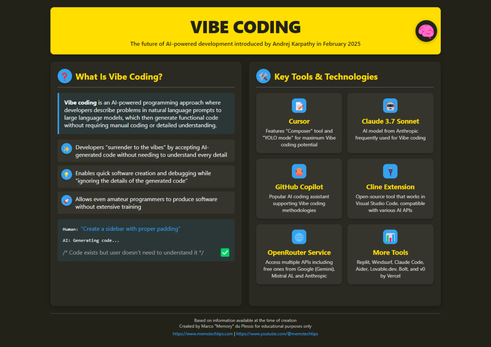
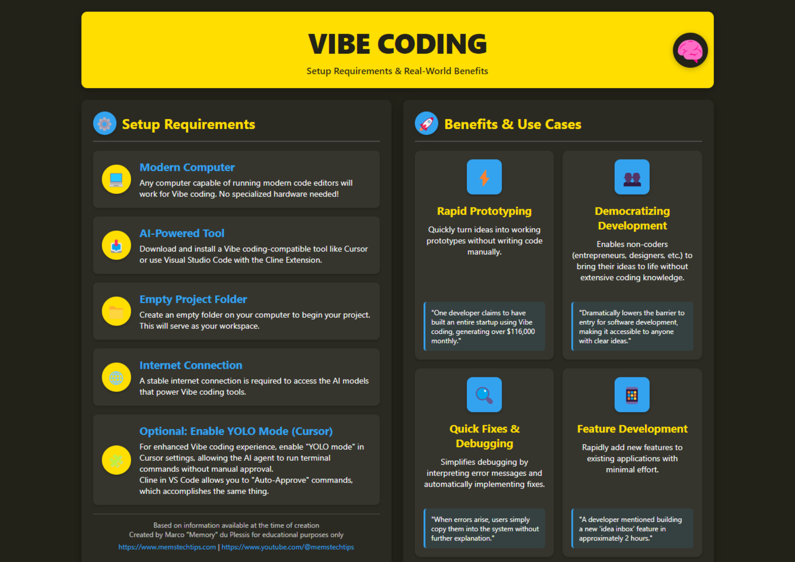
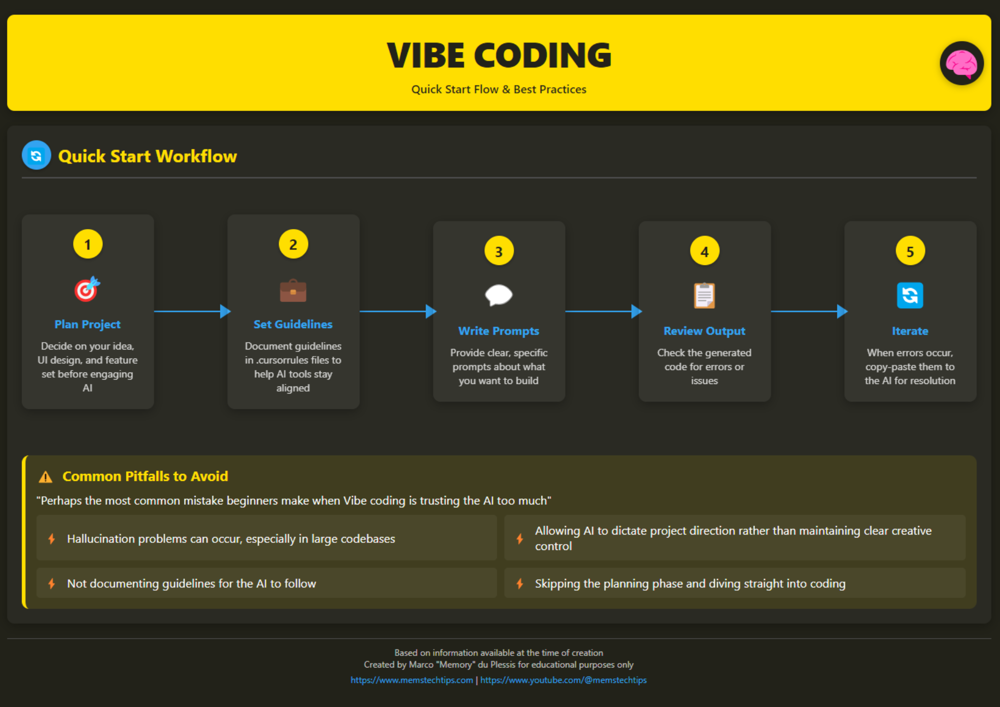
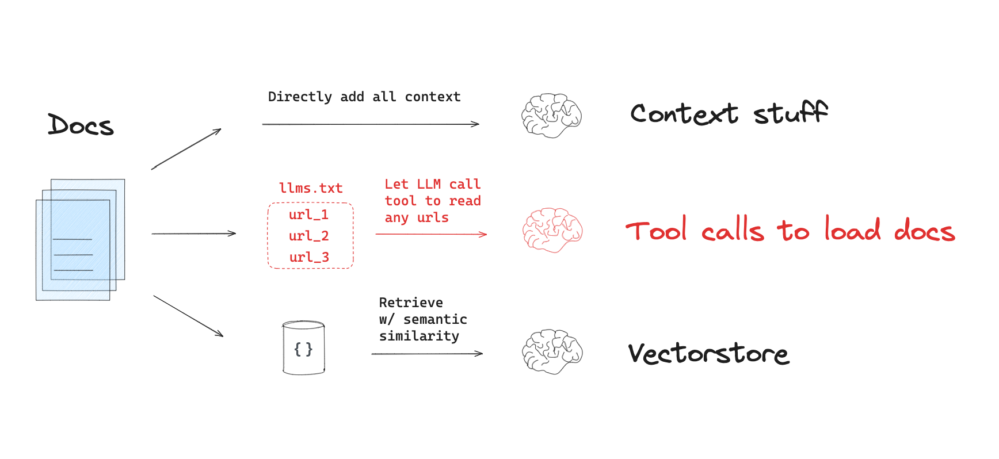
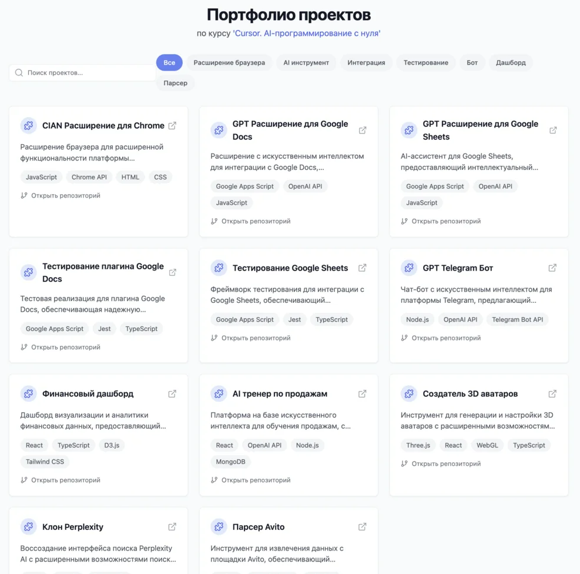

# Vibe-Coding и Cursor AI

На этом этапе мы изучим революционный подход к программированию — vibe-coding (вайб-кодинг) и познакомимся с инструментом Cursor AI, который использует искусственный интеллект для генерации кода. Вы научитесь применять эти технологии для значительного ускорения процесса разработки и создания приложений без глубоких знаний языков программирования.

<iframe width="560" height="315" src="https://www.youtube.com/embed/Tw18-4U7mts?si=2mFmUAZyvE_S622K" title="YouTube video player" frameborder="0" allow="accelerometer; autoplay; clipboard-write; encrypted-media; gyroscope; picture-in-picture; web-share" referrerpolicy="strict-origin-when-cross-origin" allowfullscreen></iframe>

## Questions

Вопросы, которые мы будем обсуждать:

- Что такое vibe-coding и как этот подход меняет традиционную разработку?
- Каким образом Cursor AI реализует концепцию vibe-coding на практике?
- Как начать работать с Cursor AI и генерировать код с помощью ИИ?
- Каковы преимущества и ограничения программирования с использованием ИИ?
- Как интегрировать vibe-coding в рабочие процессы профессиональных разработчиков?

## Steps

### 1.1. Понимание концепции vibe-coding

Vibe-coding (вайб-кодинг) — это инновационный подход к разработке программного обеспечения, предложенный исследователем Андреем Карпатым. Этот метод полностью переосмысливает процесс программирования: разработчики формулируют свои намерения на естественном языке и позволяют искусственному интеллекту генерировать большую часть фактического кода[^1].

:::warning

**Вайб-кодинг - это не простой навык**, как о нем думает большинство. На его освоение может быть разумно выделить столько же времени, сколько на изучение нового языка программирования. **Однако время, вложенное в его изучение, окупится в десятки раз.**

:::

Ключевые характеристики vibe-coding:

- Программисты "доверяются вайбу" и позволяют ИИ выполнять большую часть процесса написания кода
- Разработчики описывают задачи и требования человеческим языком
- Нейросети автоматически создают код, исправляют ошибки и реализуют необходимые функции
- Разработчики часто принимают код без полного понимания всех деталей его работы[^1]

Исследователь ИИ Саймон Уиллиссон объясняет важный нюанс: "Если нейросеть написала каждую строчку вашего кода, но вы проверили, протестировали и полностью поняли его — это уже не вайб-кодинг, а просто использование нейросети как печатной машинки"[^1].

### 1.2. Voice-to-Code: расширение возможностей вайб-кодинга

Распространение вайб-кодинга ускорило переход к программированию с помощью голосовых интерфейсов. Технология Voice-to-Code позволяет разработчикам вербально формулировать идеи, а ИИ преобразует речь в готовый и рабочий код[^1].

Такой подход особенно полезен для:

- Разработчиков с нейроразнообразием, поскольку учитывает различные когнитивные стили
- Снижения барьеров входа в IT-отрасль
- Ускорения процессов прототипирования и создания MVP

Как показывают практические примеры, с помощью голосового программирования и ИИ можно создать полноценное приложение за 15 минут без написания ни строчки кода вручную[^2].

### 1.3. Знакомство с Cursor AI как инструментом вайб-кодинга

Cursor AI — это редактор кода с интегрированным искусственным интеллектом, который является одним из ведущих инструментов для реализации вайб-кодинга на практике. Он предлагает уникальный подход к программированию, делая процесс создания приложений более доступным и эффективным[^3].

Основные функции [Cursor AI](https://www.cursor.com/):

- **Генерация кода**: мгновенное создание программного кода на основе описания задачи на естественном языке
- **Автоматизация рутинных задач**: написание шаблонов, добавление комментариев и структурирование проектов
- **Исправление ошибок**: выявление и устранение синтаксических и логических ошибок
- **Объяснение сложных частей кода**: помощь в понимании функциональности различных участков программы[^3]

### 1.4. Практическое применение Cursor AI

Чтобы начать работу с [Cursor AI](https://www.cursor.com/):

1. Скачайте и установите программу с [официального сайта](https://www.cursor.com/)
2. После установки вы увидите интерфейс, похожий на Visual Studio Code, но с дополнительными функциями ИИ
3. Для взаимодействия с ИИ вызовите раздел чата комбинацией клавиш CMD+L
4. Выберите языковую модель (для наилучших результатов рекомендуются GPT-4 или Claude 3.7 Sonnet)
5. Сформулируйте запрос на генерацию кода[^3]

Пример запроса: "Создай структуру проекта для веб-приложения на Flask, которое позволяет добавлять, удалять и просматривать задачи"[^3].

### 2. Изучите основы вайб-кодинга

<iframe width="560" height="315" src="https://www.youtube.com/embed/v7UcVPO4y3c?si=DEaVMhRwFbvj1wiF" title="YouTube video player" frameborder="0" allow="accelerometer; autoplay; clipboard-write; encrypted-media; gyroscope; picture-in-picture; web-share" referrerpolicy="strict-origin-when-cross-origin" allowfullscreen></iframe>

Инфографика по vibe-coding

### 3. [Хорошие атомарные советы](https://www.reddit.com/r/ChatGPTCoding/comments/1j5l4xw/vibe_coding_manual/)

## Extra Steps

### E1. Профессиональный Vibe-Coding

[Vibecoding Guides](https://github.com/cpjet64/vibecoding) - данные гайды написаны человеком с большим опытом. По опыту [@llm_notes](https://t.me/llm_notes) - используя советы из данных руководств, вы сможете создавать промышленные, архитектурно-сложные сервисы zero-shot.

### E2. Как вайб-кодить с учетом ВЧЕРАШНИХ изменений в вашем фреймворке?

Проблема llm-based ассистентов в том, что их претрейн был сделан на срезе интернета, сделанном в определенное время - обычно этот срез отстает на 10+ месяцев от текущего дня.
За эти месяцы появляются новые фреймворки, старые обновляются - и ассистенты пишут код, не зная об этих изменениях.

Так как же передать ассистенту эти знания? Для этого нам понадобится llm.txt и MCP:

<iframe width="560" height="315" src="https://www.youtube.com/embed/fk2WEVZfheI?si=3kpd-35HROIbbCRB" title="YouTube video player" frameborder="0" allow="accelerometer; autoplay; clipboard-write; encrypted-media; gyroscope; picture-in-picture; web-share" referrerpolicy="strict-origin-when-cross-origin" allowfullscreen></iframe>

- https://mirror-feeling-d80.notion.site/MCP-Server-for-llms-txt-1ba808527b1780b38388ee8126933592
- https://github.com/langchain-ai/mcpdoc

### E3. Дополнительные ссылки

- https://github.com/roboco-io/awesome-vibecoding?tab=readme-ov-file - список всего подряд по vibe-coding
- https://simonwillison.net/2025/Mar/11/using-llms-for-code/ - гайд для опытных девов

### E4. [Платный курс по Vibe-Coding](https://productuniversity.ru/cursor)

Цена хоть и кусается (3250 ₽/месяц в рассрочку | 78 000₽ — стоимость курса), но он является одним из лучших курсов по vibe-coding В МИРЕ на январь 2025. Я никак не связан с организаторами курса, просто такой курс есть и он хороший.

## Now we know...

Мы изучили концепцию vibe-coding как революционного подхода к программированию с использованием искусственного интеллекта. Мы познакомились с Cursor AI — редактором кода с интегрированным ИИ, который позволяет генерировать код на основе описаний на естественном языке. Теперь мы понимаем, как установить и настроить Cursor AI, как взаимодействовать с ним и формулировать запросы для генерации кода.

## Exercises

1. **Анализ и рефлексия**: Подумайте, как изменится роль программиста в мире, где большую часть кода пишет ИИ? Какие навыки станут более ценными, а какие — менее востребованными?

Ответ

https://youtu.be/psLjf6xeaj0?si=VTnLEcGEcff98jHb
примерно с 6:30 по 26:00 - глубокие мысли

P.S. Валера и Игорь - хорошие друзья

3. Установите Cursor AI и попробуйте создать простой проект (например, лендинг, калькулятор или список дел), используя только описания на естественном языке.
4. Попробуйте написать PRD для своей идеи - потом улучшите с помощью дорогой ChatGPT - потом прочитайте ее PRD и отредактируйте
5. Полезно для жизни - попросите Агента "сделать для вас какой-нибудь график, используя python и библиотеку seaborn"

⁂

[^1]: https://vc.ru/ai/1868358-vaib-koding-kak-novyi-sposob-razrabotki-programmnogo-obespecheniya

[^2]: https://www.youtube.com/watch?v=FXYPc-L-pnk

[^3]: https://dzen.ru/a/Z9VP64QnBwBkY7cE

[^4]: https://coursehunter.net/course/cursor-programmirovanie-s-ai

[^5]: https://www.youtube.com/watch?v=OZaxtm3RyCw

[^6]: https://www.itrn.ru/expertise/detail.php?id=204078

[^7]: https://habr.com/ru/news/895504/

[^8]: https://itinai.ru/cursor-инновационный-редактор-кода-ide-испол?query-24-page=3

[^9]: https://www.youtube.com/watch?v=XpPrOgVyI98

[^10]: https://techcrunch.com/2025/03/14/ai-coding-assistant-cursor-reportedly-tells-a-vibe-coder-to-write-his-own-damn-code/

[^11]: https://habr.com/ru/news/895918/

[^12]: https://www.youtube.com/watch?v=dan3QfN3CDU

[^13]: https://dzen.ru/a/Z39of6JA-1YoFUi-

[^14]: https://coursehunter.net/course/cursor-ai-polnoe-rukovodstvo-dlya-razrabotchikov

[^15]: https://www.youtube.com/watch?v=oFAPQv5UikM

[^16]: https://ru.wikipedia.org/wiki/Вайб-кодинг

[^17]: https://www.youtube.com/watch?v=CW1aPily6-Q

[^18]: https://productuniversity.ru/cursor

[^19]: https://www.youtube.com/watch?v=pHNOhptPKQI

[^20]: https://dev.to/charlene_/vibe-coding-with-ai-agents-lol-4bkd

